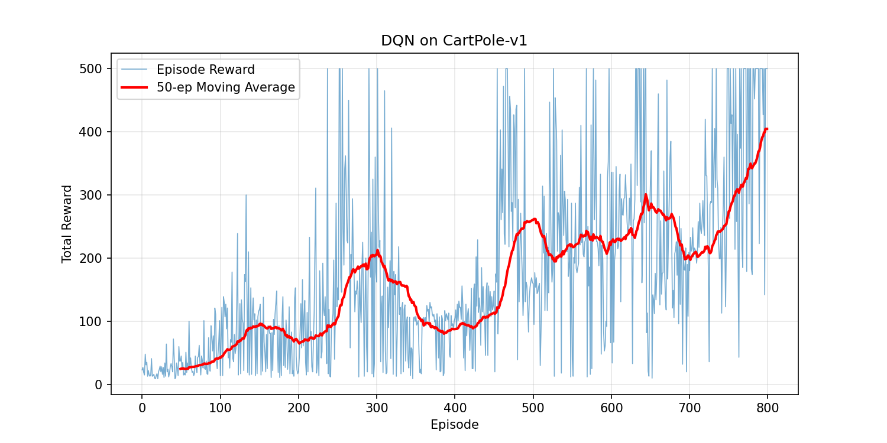

# DQN for CartPole

A from-scratch implementation of **Deep Q-Network (DQN)** to solve the
[CartPole-v1](https://gymnasium.farama.org/environments/classic_control/cart_pole/)
environment from Gymnasium.

## What is CartPole?

A pole is attached to a cart moving along a track. The agent must apply a force
(left or right) to keep the pole balanced upright. The episode ends when the
pole falls or the cart moves out of bounds.

- **Observation space:** 4 (cart position, cart velocity, pole angle, pole angular velocity)
- **Action space:** 2 (push left, push right)
- **Max reward:** 500 per episode

## Approach

This implementation follows the DQN algorithm from Mnih et al. (2013):

- **Q-Network:** 4 → 128 → 128 → 2 (MLP with ReLU activations)
- **Experience replay** buffer of 10,000 transitions
- **Target network** updated every 10 episodes for stability
- **Epsilon-greedy** exploration decaying from 1.0 to ~0.01

## Results

The agent converges to near the maximum score (500) within ~800 episodes,
achieving an average reward of **404.7** over the last 50 episodes.



## Quick Start

```bash
# Install dependencies
pip install gymnasium torch numpy matplotlib

# Train
python dqn_cartpole.py
```

A training curve `training_curve.png` will be generated automatically.

## References

- Mnih, V., et al. (2013). [Playing Atari with Deep Reinforcement Learning](https://arxiv.org/abs/1312.5602). *arXiv:1312.5602*.
- [Gymnasium CartPole Documentation](https://gymnasium.farama.org/environments/classic_control/cart_pole/)
